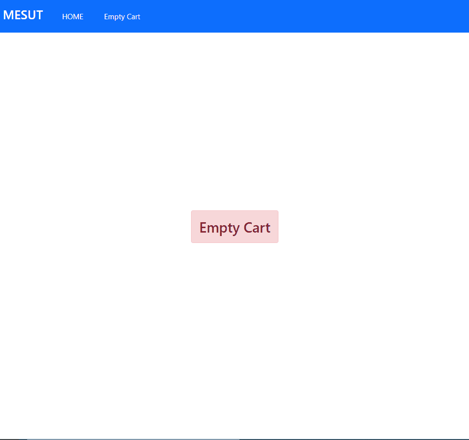

# redux-sell-app

>**I used**
>```
> React, ReactStrap, Bootstrap, Redux
>```
>In this project data came from json-server
>``` 
> npm install -g json-server
>
>json-server --watch <json file path>
>```
> You can:
>```
>update product
>
>add to char
>
>remove from chart
>```
>...


